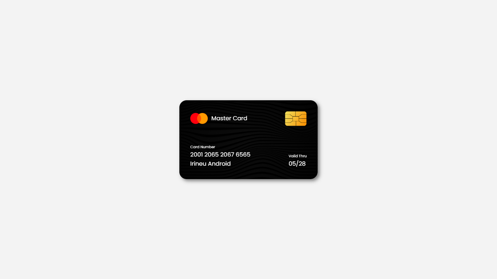

# Credit-Card-Design-CSS
<h3>EN - RBG effect with animations using HTML - Pure CSS: transitions and @keyframes;</h3>
<h3>PT - Master Card Credit Card made using HTML and CSS;</h3>

<h4>Future update: Flip hover to card, wait!</h4>

<h4>Deploy: https://johnandrade65.github.io/Credit-Card-Design-CSS/</h4>

 
  
  

